# C-Interpreter

> Project: Rewrite the project `C4` with a easier to understand approach;
> [c4](https://github.com/rswier/c4), created by the author rswier;

The purpose of this project is to provide a clear and understandable rewrite of the original `c4` project—a minimal C compiler that became popular for its ability to self-host (compile itself) using only four core functions. While the original `c4` is impressive for its compactness and completeness, its code is intentionally obfuscated and difficult to follow, as it was designed to minimize code size above all else. This project aims to retain the core functionality and educational value of `c4`, but with clean, well-structured, and well-documented code that is accessible to learners and developers interested in compiler construction.

## There are mainly four aspects we gonna focus on in this project: 
#### How to Represent Syntax (BNF, etc.)

- Syntax of programming languages is often described using formal grammars.
- Backus-Naur Form (BNF) is a common notation for expressing context-free grammars.
- Extended BNF (EBNF) adds more expressive power and convenience.

#### Lexical Analysis: Finite and Infinite Automata

- Lexical analysis breaks source code into tokens (identifiers, keywords, symbols, etc.).
- Finite Automata (FA) are used to recognize regular languages, which are suitable for token patterns.
  - Deterministic Finite Automata (DFA) and Nondeterministic Finite Automata (NFA) are two types.
- Infinite automata are not typically used in lexical analysis; regular languages are always recognized by finite automata.

#### Syntax Analysis: Recursive Descent, LL(k), LALR Parsing

- Syntax analysis (parsing) checks if token sequences conform to the grammar.
- Recursive Descent Parsing is a top-down parsing technique, easy to implement for LL grammars.
- LL(k) parsers read input Left-to-right, produce a Leftmost derivation, and use k tokens of lookahead.
- LALR (Look-Ahead LR) parsers are a type of bottom-up parser, commonly used in parser generators (like Yacc/Bison), and can handle a wider range of grammars than LL parsers.
- 語法分析（parsing）就係檢查一串 token 係咪跟 grammar 規則。
- Recursive Descent Parsing 係一種 top-down 解析方法，好易 implement，啱用 LL grammar。
- LL(k) parser 係由左至右讀 input，做左推導（Leftmost derivation），可以睇前面 k 個 token 幫手決定點 parse。
- LALR（Look-Ahead LR）parser 係 bottom-up 解析，通常用 parser generator（好似 Yacc/Bison）整，處理 grammar 範圍比 LL parser 更加廣。

#### Intermediate Code Representation

- Intermediate code is an abstraction between source code and machine code.
- Common forms include three-address code, quadruples, and abstract syntax trees (AST).
- Intermediate code simplifies optimization and code generation.
- 中間碼（Intermediate code）係 source code 同機器碼之間嘅一層抽象。
- 常見有三地址碼（three-address code）、四元式（quadruples）、抽象語法樹（AST）。
- 用中間碼可以方便做優化同生成機器碼。

## Code Generation

- Code generation translates intermediate code into target machine code or assembly.
- Involves instruction selection, register allocation, and handling calling conventions.
- 代碼生成（Code generation）就係將中間碼轉做目標機器碼或者組合語言。
- 包括指令選擇、暫存器分配、同埋處理呼叫規則（calling convention）。

## Code Optimization

- Code optimization improves the efficiency of the generated code.
- Can be performed at various stages: source-level, intermediate code, or machine code.
- Techniques include dead code elimination, constant folding, loop optimization, and inlining.
- 代碼優化（Code optimization）係令生成出嚟嘅代碼跑得快啲或者慳資源。
- 可以喺唔同階段做：source code、intermediate code、machine code。
- 技巧有：死碼消除（dead code elimination）、常數摺疊（constant folding）、迴圈優化（loop optimization）、inline 展開（inlining）。

## A question beforehand: Interpreter vs Compiler:

- **Interpreter:**
  - Executes source code directly, line by line or statement by statement.
  - No separate output file; runs the program immediately.
  - Easier to debug and test code interactively.
  - Slower execution speed compared to compiled code.
  - Examples: Python, Ruby, JavaScript.

- **Compiler:**
  - Translates source code into machine code or intermediate code before execution.
  - Produces an output file (e.g., executable or bytecode) that can be run later.
  - Program runs faster after compilation.
  - Errors are detected before execution, during the compilation step.
  - Examples: C, C++, Rust, Go.


In this project, when we say is a "C language compiler," what we're actually building is a C language interpreter. This means we can run C source code files directly, just like running a script. There are two main reasons for doing this:

1. The only real difference between an interpreter and a compiler is in the code generation stage; other parts like lexical analysis and parsing are the same.
2. Building an interpreter requires us to implement our own virtual machine and instruction set, which helps us better understand how computers work under the hood.

### Practial steps to construct a compiler: 
Generally, writing a compiler involves three main steps:

1. Lexical analysis(詞法分析器): converting the input string into an internal representation (tokens).
    - A **token** is a basic unit of meaning identified during lexical analysis. In the context of a compiler, tokens are categories such as keywords (e.g., `int`, `if`), identifiers (variable names), operators (`+`, `-`), literals (numbers, strings), and punctuation (semicolons, parentheses). The lexer scans the input source code and groups characters into these tokens, which are then used by the parser to understand the structure of the code.

2. Syntax analysis(語法分析器): using the stream of tokens from lexical analysis to build a syntax tree.
3. Code generation: transforming the syntax tree into target code.

There are many tools available to help with steps 1 and 2, such as flex for lexical analysis and bison for syntax analysis. However, these tools are very powerful and hide many implementation details, which is not ideal for learning how to build a compiler from scratch. Therefore, we will implement these components by hand.

In this project, we will follow these steps to build our compiler:

1. Build our own virtual machine and instruction set. The target code we generate will be for this instruction set.
2. Implement our own lexical analyzer.
3. Implement our own syntax analyzer.

### Framework for the compiler:
### Compiler Framework

Our compiler mainly consists of four functions:

- `next()`: Performs lexical analysis and retrieves the next token. It automatically skips whitespace characters.
- `program()`: The entry point for syntax analysis, responsible for parsing the entire C program.
- `expression(level)`: Parses an expression. This function is separated out because expressions are relatively independent and complex in syntax analysis, so we modularize it as its own function.
- `eval()`: The entry point for the virtual machine, responsible for interpreting the generated target code.

For the hardcoded version of the framework, please refer to `framework.c`.
**Important**: 
- argc implies: number of arguments; 
- argv implies array of arguments; 
- The program will read a doucument of C langauge, and parse every character in the document, then provide output. 

> Expected format for argc and argv:
- argc: The number of command-line arguments passed to the program, including the program name itself as argv[0].
- argv: An array of character pointers (strings), where:
    - argv[0] is the name of the program (e.g., "./framework").
    - argv[1] to argv[argc-1] are the actual arguments provided by the user.

Example:
- If the program is run as: `./framework test.c`

```
    argc == 2
    argv[0] == "./framework"
    argv[1] == "test.c"
```

### Computer architecture and working principle: 
- In general, a computer has three main components we need to care about: the CPU, registers(寄存器), and memory.
> Registers（寄存器）係 CPU 入面嘅一啲超高速細細粒嘅記憶體，用嚟暫存數據同指令。例如你做加數、減數、搬運數據，全部都會經過 registers。佢哋好似你做運算時手上拎住嘅計數機，快過你去記住啲數喺普通記憶體（RAM）度。每個 register 都有唔同用途，例如儲存運算結果、記住下一條要執行嘅指令位置（program counter）、或者暫存某啲變數。因為 registers 喺 CPU 入面，所以讀寫速度極快，對電腦運作好重要。

- The code (such as assembly instructions) is stored in memory as binary data. The CPU loads and executes these instructions one by one. The current state of the program (like variable values and where you are in the code) is kept in the registers.

**Memory**
- Memory is used to store data, which can be either your program's code or other information. 
- Modern operating systems use something called "virtual memory" instead of directly using the physical memory (RAM) in your computer.
  >  Windows、macOS、Linux）會用一種叫「虛擬記憶體」嘅技術，唔係直接用你部電腦嘅實體記憶體（RAM）。
- Virtual memory acts like a map: it lets programs use a large range of addresses (for example, on a 32-bit system, 2^32 up to 4GB), even if the actual physical memory is much less (like 256MB).
- The operating system handles the mapping between virtual addresses and real memory.

**Program's memory is divided into several sections, called "segments."**
- **Text segment (code):** Stores the program's instructions.  
  - The actual instructions your CPU will execute (the binary code generated from your source code) are stored in the text segment of memory.

- **Data segment:** Stores variables that are initialized at the start.  
  *Example:* `int i = 10;` — the value 10 is stored in the data segment.

- **BSS segment（未初始化數據段）:** Stores variables that are declared but not 
initialized.  
  *Example:* `int arr[1000];` Since we don't care about the initial values, these are put in the BSS segment to save space.

- **Stack:** Used for function calls, local variables, and keeping track of where to return after a function finishes.  
  *Example:* When you call a function, its local variables and return address are stored on the stack.

- **Heap:** Used for dynamic memory allocation (memory you request at runtime).  
  *Example:* When you use `malloc` in C or `new` in C++, the memory comes from the heap.

## Memory Layout Visualization

The following diagram shows the typical memory layout of a program in virtual memory:

```mermaid
graph TD
    %% Memory Layout Diagram
    subgraph "Virtual Memory Address Space"
        A["📚 Stack<br/>(High Address)<br/>Function calls, local variables<br/>Grows downward"]
        B["🗂️ Heap<br/>Dynamic memory allocation<br/>malloc(), free()<br/>Grows upward"]
        C["📋 BSS Segment<br/>Uninitialized global/static variables<br/>Zero-initialized"]
        D["💾 Data Segment<br/>Initialized global/static variables<br/>Constants, initialized data"]
        E["⚙️ Text Segment<br/>(Low Address)<br/>Executable code<br/>Read-only"]
    end
    
    %% Address flow
    A -->|"High Address"| B
    B -->|"Growing upward"| C
    C -->|"Static data"| D
    D -->|"Low Address"| E

    
    class A stackStyle
    class B heapStyle
    class C bssStyle
    class D dataStyle
    class E textStyle
```




#### Future improvements and references:
- [Let's Build a Compiler](http://compilers.iecc.com/crenshaw/)
- [Lemon Parser Generator](http://www.hwaci.com/sw/lemon/)