# Compiler Framework and virtual machine:

Our compiler mainly consists of four functions:

- `next()`: Performs lexical analysis and retrieves the next token. It automatically skips whitespace characters.
- `program()`: The entry point for syntax analysis, responsible for parsing the entire C program.
- `expression(level)`: Parses an expression. This function is separated out because expressions are relatively independent and complex in syntax analysis, so we modularize it as its own function.
- `eval()`: The entry point for the virtual machine, responsible for interpreting the generated target code.

For the hardcoded version of the framework, please refer to `framework.c`.
**Important**:

- argc implies: number of arguments;
- argv implies array of arguments;
- The program will read a doucument of C langauge, and parse every character in the document, then provide output.

> Expected format for argc and argv:

- argc: The number of command-line arguments passed to the program, including the program name itself as argv[0].
- argv: An array of character pointers (strings), where:
  - argv[0] is the name of the program (e.g., "./framework").
  - argv[1] to argv[argc-1] are the actual arguments provided by the user.

Example:

- If the program is run as: `./framework test.c`

```
    argc == 2
    argv[0] == "./framework"
    argv[1] == "test.c"
```

### Computer architecture and working principle:

- In general, a computer has three main components we need to care about: the CPU, registers(寄存器), and memory.

> Registers（寄存器）係 CPU 入面嘅一啲超高速細細粒嘅記憶體，用嚟暫存數據同指令。例如你做加數、減數、搬運數據，全部都會經過 registers。佢哋好似你做運算時手上拎住嘅計數機，快過你去記住啲數喺普通記憶體（RAM）度。每個 register 都有唔同用途，例如儲存運算結果、記住下一條要執行嘅指令位置（program counter）、或者暫存某啲變數。因為 registers 喺 CPU 入面，所以讀寫速度極快，對電腦運作好重要。

- The code (such as assembly instructions) is stored in memory as binary data. The CPU loads and executes these instructions one by one. The current state of the program (like variable values and where you are in the code) is kept in the registers.

**Memory**

- Memory is used to store data, which can be either your program's code or other information.
- Modern operating systems use something called "virtual memory" instead of directly using the physical memory (RAM) in your computer.
  > Windows、macOS、Linux）會用一種叫「虛擬記憶體」嘅技術，唔係直接用你部電腦嘅實體記憶體（RAM）。
  >
- Virtual memory acts like a map: it lets programs use a large range of addresses (for example, on a 32-bit system, 2^32 up to 4GB), even if the actual physical memory is much less (like 256MB).
- The operating system handles the mapping between virtual addresses and real memory.

**Program's memory is divided into several sections, called "segments."**

- **Text segment (code):** Stores the program's instructions.

  - The actual instructions your CPU will execute (the binary code generated from your source code) are stored in the text segment of memory.
- **Data segment:** Stores variables that are initialized at the start.*Example:* `int i = 10;` — the value 10 is stored in the data segment.
- **BSS segment（未初始化數據段）:** Stores variables that are declared but not
  initialized.*Example:* `int arr[1000];` Since we don't care about the initial values, these are put in the BSS segment to save space.
- **Stack:** Used for function calls, local variables, and keeping track of where to return after a function finishes.*Example:* When you call a function, its local variables and return address are stored on the stack.
- **Heap:** Used for dynamic memory allocation (memory you request at runtime).
  *Example:* When you use `malloc` in C or `new` in C++, the memory comes from the heap.

#### Memory Layout Visualization

The following diagram shows the typical memory layout of a program in virtual memory:

```mermaid
graph TD
    %% Memory Layout Diagram
    subgraph "Virtual Memory Address Space"
        A["📚 Stack<br/>(High Address)<br/>Function calls, local variables<br/>Grows downward"]
        B["🗂️ Heap<br/>Dynamic memory allocation<br/>malloc(), free()<br/>Grows upward"]
        C["📋 BSS Segment<br/>Uninitialized global/static variables<br/>Zero-initialized"]
        D["💾 Data Segment<br/>Initialized global/static variables<br/>Constants, initialized data"]
        E["⚙️ Text Segment<br/>(Low Address)<br/>Executable code<br/>Read-only"]
    end
  
    %% Address flow
    A -->|"High Address"| B
    B -->|"Growing upward"| C
    C -->|"Static data"| D
    D -->|"Low Address"| E

  
    class A stackStyle
    class B heapStyle
    class C bssStyle
    class D dataStyle
    class E textStyle
```



> Our virtual machine does **not** simulate a full computer memory layout. For simplicity, we only care about three main regions:

1. **Text segment (code):** Stores the program's instructions.
2. **Data segment:** Used only for storing string literals (since our compiler does not support initialized variables, we do **not** need a BSS segment).
3. **Stack:** Used for function calls, local variables, and control flow.

We **do not** implement a heap for dynamic memory allocation. Instead, we introduce a special instruction `MSET` that allows us to directly use memory managed by the interpreter for any memory allocation needs in user programs.

First, lets introduce some global variables to the program: 
```c
int *text,              //text segment
    *old_text,          //for dumb text segment
    *stack;             
char *data;             //data segment
```

Although the type is 'int', we should conceptually treat these as unsigned integers (meaning it must be non negative numbers), since the text segment will store things like pointers or memory addresses, which are unsigned values. 
The data segment is of type 'char *' because it only stores string literals.

> **What is the difference between `malloc` and `memset`?**

- `malloc(size)` allocates a block of memory of the given size (in bytes) and returns a pointer to the beginning of the block. The contents of the allocated memory are **not initialized**; they may contain garbage values.
- `memset(ptr, value, size)` sets the first `size` bytes of the memory block pointed to by `ptr` to the specified `value` (usually 0 to clear the memory). It does **not** allocate memory; it only modifies the contents of an existing memory block.

**In summary:**  
- Use `malloc` to allocate memory.  
- Use `memset` to initialize or clear memory that has already been allocated.

Registers

In a real computer, registers are used to store the current state of the CPU. There are many types of registers in actual hardware, but our virtual machine only uses four main registers:

1. PC (Program Counter): Holds the memory address of the next instruction to execute.  
   （好似一個指路牌，指住你下一步要行去邊度。）

2. SP (Stack Pointer): Always points to the top of the stack. Note that in our VM, the stack grows downward (from high to low addresses), so pushing a value decreases SP.  
   （就好似一支筷子插喺一疊碟頂，邊個碟喺最頂就指住邊個。）

3. BP (Base Pointer): Used to point to specific positions within the stack, especially during function calls.  
   （好似你用書籤夾住書入面某一頁，方便你返去搵返嗰個位。）

4. AX (Accumulator): A general-purpose register used to store the result of the most recent instruction.  
   （就好似一個膠袋，臨時裝住你啱啱買返嚟嘅嘢。)

These registers are essential for tracking the state of the program as it runs. In our implementation, we define them as global variables:
```c
int *pc, *bp, *sp, ax, cycle; //virtual machine registers; 
```

Add initialization code in the main function. Note that the PC (program counter) should initially point to the main function in the compiled code, but since we haven't implemented any compilation logic yet, we will leave that part for later. The code is as follows:
```cpp
memset(stack, 0, poolsize);
...
// This line sets both the base pointer (bp) and stack pointer (sp) to point to the top of the stack segment.
// (int)stack converts the stack pointer to an integer address, adds poolsize (the total size of the stack in bytes),
// and then casts it back to (int *) so that bp and sp point to the end of the allocated stack memory.
// This means the stack will grow downward from this address as values are pushed onto it.
bp = sp = (int *)((int)stack + poolsize);
ax = 0;
...
program();
```


